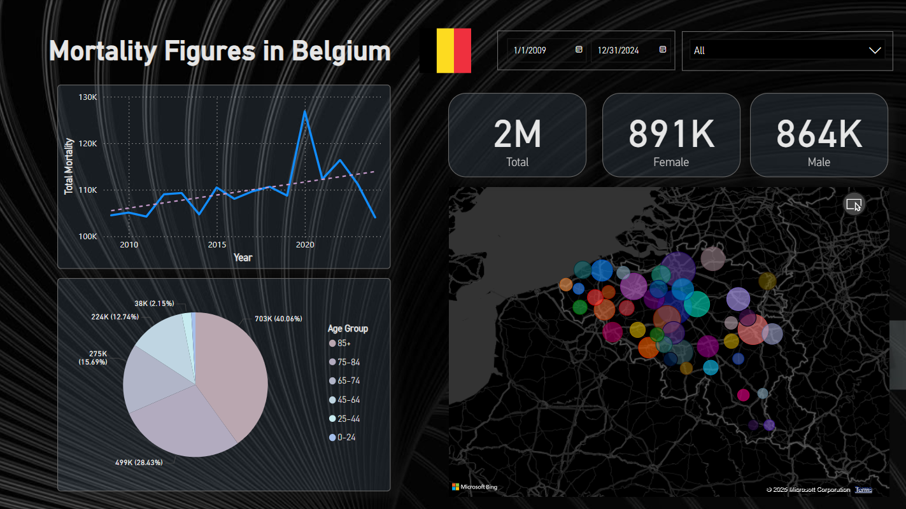
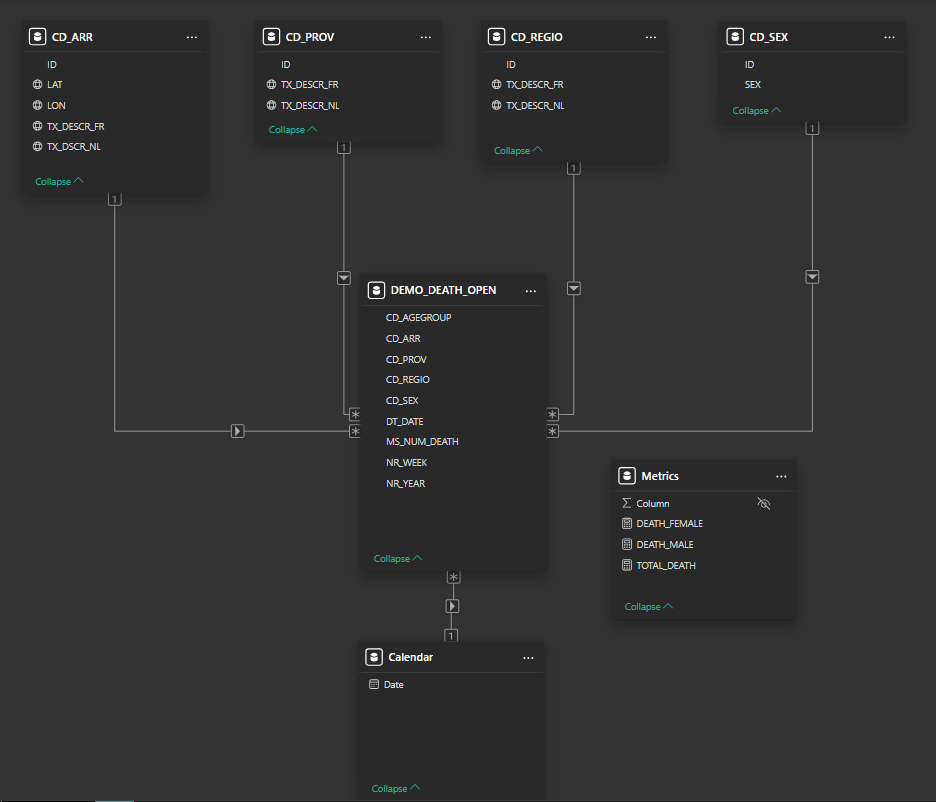

# Mortality Analysis

A technical-analytical project exploring mortality trends in Belgium using open government data. This repository combines Power BI dashboarding with Python-based exploratory data analysis.

## General Info

The project presents and explores mortality data from Belgium, segmented by:
- Gender
- Age groups
- Regions, provinces, and municipalities
- Time (daily, weekly, yearly trends)

## Data Source

All data comes from the official Belgian Statistical Office:

[Statbel Open Data - Mortality](https://statbel.fgov.be/en/open-data/number-deaths-day-sex-district-age)

## Technologies Used

- **Power BI**: for interactive dashboard creation
- **Python**: for data wrangling and exploratory analysis
- **Jupyter Notebook**: for transparent, reproducible workflows

## Screenshots

### Power BI Dashboard

### Power BI Data Model
